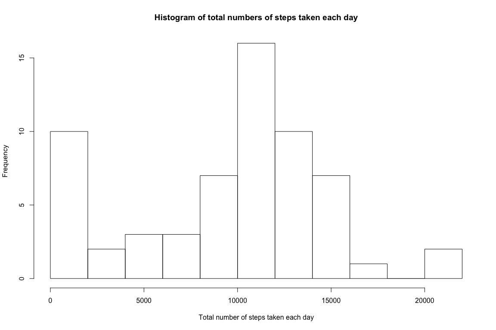
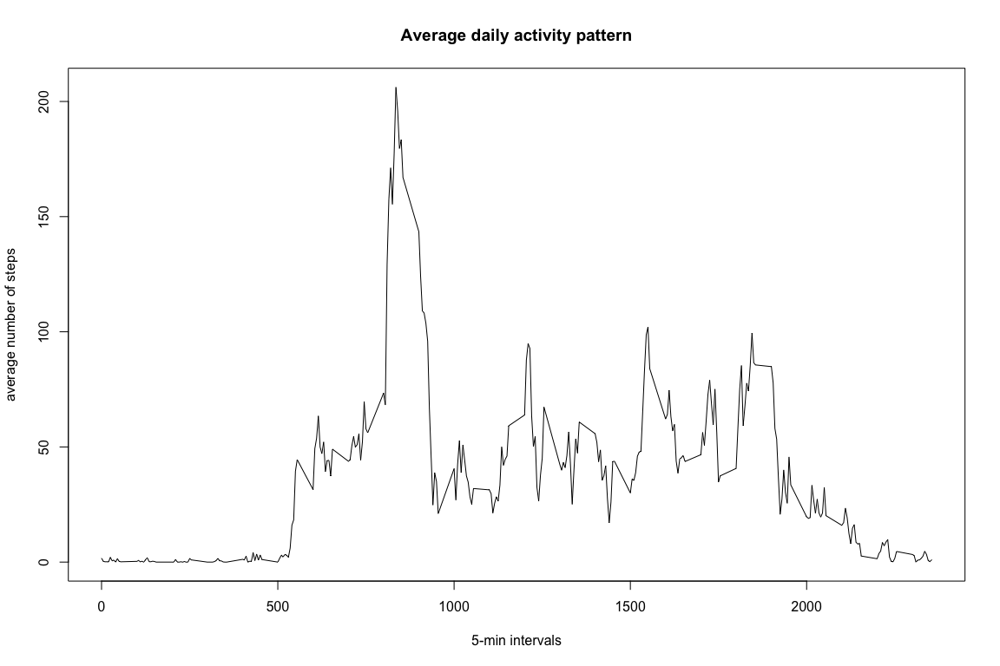
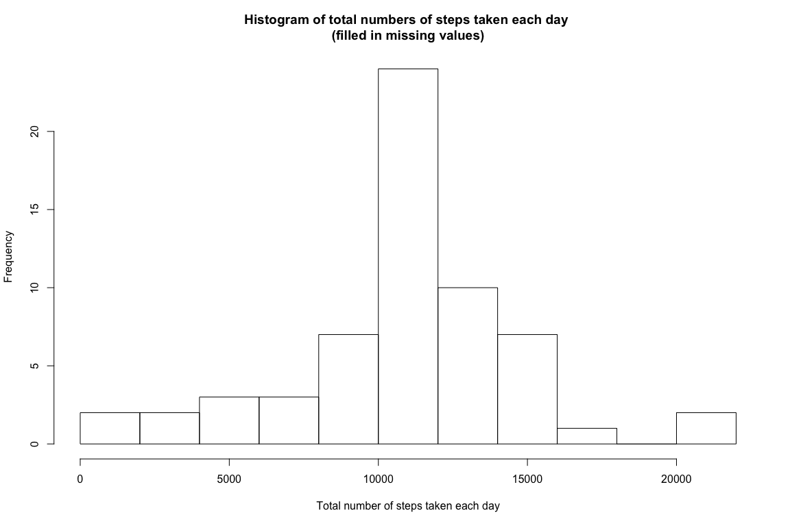
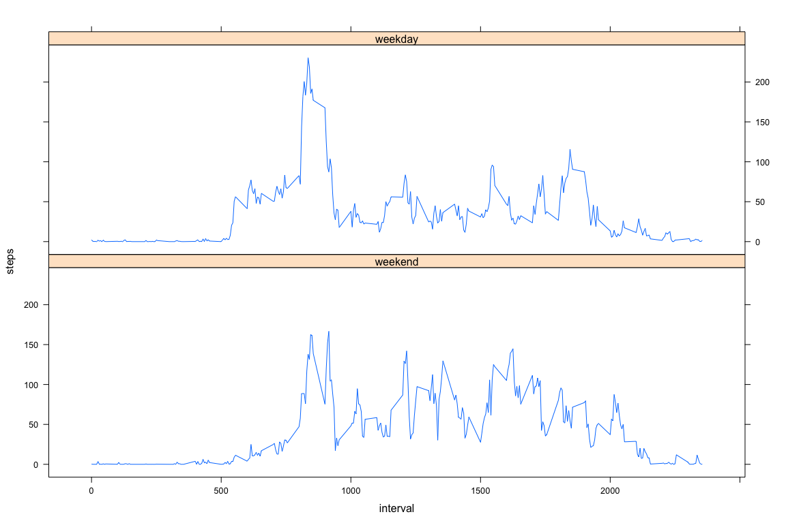

# Reproducible Research: Peer Assessment 1


## Loading and preprocessing the data

1. Loading the data:

```r
data<-as.data.frame(read.csv("/Users/kaser/Desktop/Data Science Specialization/Reproducible Research/PeerAssignement1/activity.csv"))
```

2. Preprocessing data:
Change format on the date column of the data set


```r
data$date<-as.Date(data$date)
```
## What is mean total number of steps taken per day?

For this part of the assignment (as suggested in the assignement) the missing values in the data set are ignored.

1. Calculate the total number of steps taken per day


```r
steps_per_day<-tapply(data$steps, as.factor(data$date), FUN=sum, na.rm=TRUE)  
```

2. Make a histogram of the total number of steps taken each day

```r
hist(steps_per_day, breaks=10, xlab="Total number of steps taken each day", 
     main="Histogram of total numbers of steps taken each day")
```

 

3. Calculate and report the mean and median of the total number of steps taken per day

```r
mean_steps_per_day<-mean(steps_per_day, na.rm = TRUE)
cat("The mean of the total number of steps taken per day was:", round(mean_steps_per_day)) 
```

```
## The mean of the total number of steps taken per day was: 9354
```

```r
median_steps_per_day<-median(steps_per_day, na.rm = TRUE)
cat("The median of the total number of steps taken per day was:", round(median_steps_per_day)) 
```

```
## The median of the total number of steps taken per day was: 10395
```

## What is the average daily activity pattern?

1. Make a time series plot (i.e. type = "l") of the 5-minute interval (x-axis) and the average number of steps taken, averaged across all days (y-axis)


```r
avg_num_steps<-tapply(data$steps, as.factor(data$interval), FUN=mean, na.rm=TRUE) 

plot(as.numeric(names(avg_num_steps)),avg_num_steps,type="l",xlab="5-min intervals",
     ylab="average number of steps", main="Average daily activity pattern")
```

 

2. Which 5-minute interval, on average across all the days in the dataset, contains the maximum number of steps?


```r
max_5min_interval<-names(which.max(avg_num_steps))
cat("The 5-minute interval containing the maximum number of steps is:", max_5min_interval) 
```

```
## The 5-minute interval containing the maximum number of steps is: 835
```

## Imputing missing values


1. Calculate and report the total number of missing values in the dataset (i.e. the total number of rows with NAs)


```r
sum_na_rows<-sum(is.na(data$steps))
cat("The total number of rows with NAs is:", sum_na_rows) 
```

```
## The total number of rows with NAs is: 2304
```

2.  Creating a new data set that is equal to the original data set replacing the missing values with the mean of the 5-min interval corresponding to the missing value time interval.


```r
## Filling in the data with the mean for that 5-minute interval
data_no_NA<-data
for (i in 1:dim(data)[1]){
        if (is.na(data$steps[i])){
                #find the corresponding 5-min interval
                interval_index<-which(as.numeric(names(avg_num_steps))==data_no_NA$interval[i])
                data_no_NA$steps[i]<-avg_num_steps[interval_index]
        } else {
                data_no_NA$steps[i]<-data$steps[i]
        }
}
```

3.   Make a histogram of the total number of steps taken each day and calculate and report the mean and median total number of steps taken per day. Do these values differ from the estimates from the first part of the assignment? What is the impact of imputing missing data on the estimates of the total daily number of steps?


```r
steps_per_day_noNA<-tapply(data_no_NA$steps, as.factor(data_no_NA$date), FUN=sum, na.rm=TRUE)  
hist(steps_per_day_noNA, breaks=10, xlab="Total number of steps taken each day", 
     main="Histogram of total numbers of steps taken each day \n(filled in missing values)")
```

 

```r
mean_steps_per_day_noNA<-mean(steps_per_day_noNA)
cat("The mean of the total number of steps taken per day after filling in missing values was:", 
    round(mean_steps_per_day_noNA)) 
```

```
## The mean of the total number of steps taken per day after filling in missing values was: 10766
```

```r
median_steps_per_day_noNA<-median(steps_per_day_noNA)
cat("The median of the total number of steps taken per day after filling in missing values was:", 
    round(median_steps_per_day_noNA)) 
```

```
## The median of the total number of steps taken per day after filling in missing values was: 10766
```

**The mean and the median increased when the NAs were replaced with the 5-min average values**. 


## Are there differences in activity patterns between weekdays and weekends?

For this part the dataset with the filled-in missing values was used.

1. Create a new factor variable in the dataset with two levels – “weekday” and “weekend” indicating whether a given date is a weekday or weekend day.


```r
#create a vector of weekdays
weekdays1 <- c('Monday', 'Tuesday', 'Wednesday', 'Thursday', 'Friday')
#Use `%in%` and `weekdays` to create a logical vector
#convert to `factor` and specify the `levels/labels`
data_no_NA$wDay <- factor(weekdays(as.Date(data_no_NA$date)) %in% weekdays1, levels=c(FALSE, TRUE), labels=c('weekend', 'weekday') )
```

3.     Make a panel plot containing a time series plot (i.e. type = "l") of the 5-minute interval (x-axis) and the average number of steps taken, averaged across all weekday days or weekend days (y-axis). 


```r
library(lattice)

data_no_NA$date<-as.Date(data_no_NA$date)
aggdata <-aggregate(data_no_NA, by=list(Interval=data_no_NA$interval,WDay=data_no_NA$wDay), FUN=mean, na.rm=TRUE)

xyplot(steps~interval|WDay,data=aggdata,type="l",layout=c(1,2))
```

 

**The number of steps increase later in the day during the weekend and the maximum number of steps is lower on the weekend**
